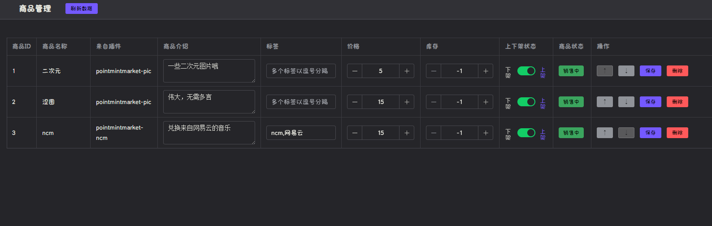

# 积分商城插件 (pointmintmarket)

[](https://www.npmjs.com/package/koishi-plugin-pointmintmarket)

积分商城系统 - 为其他插件提供商品注册和购买功能，降低开发者的开发难度和提高用户的易用性。

## 功能特点

- 统一的商品注册和管理接口
- 完整的商品购买流程（开发中）
- 灵活的商品分类和标签系统（开发中）
- 库存管理功能
- 购买记录追踪（开发中）
- 良好的用户交互界面

## 插件界面


## 使用方法

### 安装与配置
1. 使用商城安装依赖插件：[koishi-plugin-pointmint](currentColor)
2. 安装本插件
3. 依照你的需求安装你所需要的插件，例如：
  - [`pointmintmarket-ncm`](https://github.com/DMB-codegang/koishi-plugin-PointmintMarket-ncm) —— 网易云音乐插件
  - [`pointmintmarket-pic`](https://github.com/DMB-codegang/Koishi-Plugin-PointmintMarket-Pic) —— 兑换图片与文本的插件
4. 启用这些插件，在侧边栏的`积分商城管理`中配置商品的信息
5. ~~看我干啥，用啊~~

### 用户命令

- `商城` - 查看商城商品列表
- `兑换 <商品id>` - 兑换指定商品

## 开发者接入

这是一个基本的接入示例：

```typescript
import { Context } from 'koishi'

export const inject = ['market']

export function apply(ctx: Context) {
  ctx.market.registerItem('your-plugin-name', {
    name: '测试商品',
    description: '这是一个测试商品',
    tags: ['测试', '示例'],
    onPurchase: async (session) => {
      // 处理购买逻辑
      await session.send(`用户 ${username} 购买了测试商品`)
      return true // 返回购买处理结果
    }
  })
}
```

如上面展示的那样`market.registerItem` 方法用于注册商品，需要你填入以下参数：
- `name` - 商品名称
- `description` - 商品描述
- `tags` - 商品标签
- `onPurchase` - 购买回调函数，用于处理购买逻辑。

### 关于onPurchas
值得注意的是，`onPurchase`函数需要一个返回值。你可以简单的返回`true`/`false`来表示购买是否成功，就像上面示例中展示的那样。你也可以返回一个字符串，给用户展示购买失败的原因，商城将为你展示给用户。例如：
```typescript
onPurchase: async (session) => {
  return '网络异常' // 返回购买处理结果
}
```
你还可以返回一个包含`code`和`msg`的对象，用于详细展示。如：
```typescript
onPurchase: async (session) => {
  return {
    code: 1,
    msg: '库存不足'
  } // 返回购买处理结果
}
```

## 版本日志
### v0.1.4
- 修复：商城指令报错问题
### v0.1.3
- 新增：商城icon